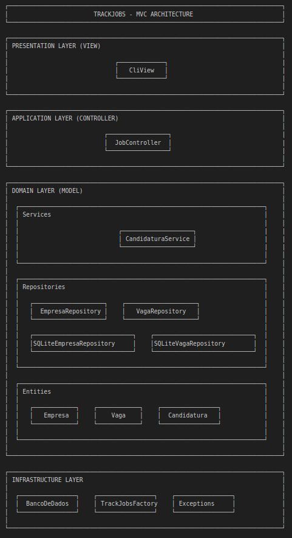

# Arquitetura em Camadas

## Explicação dos Componentes

### Entities (objetos de Domínio)

- Empresa: Representa uma empresa onde você pode se candidatar
- Vaga: Representa uma vaga de emprego
- Candidatura: Agrega vaga e empresa

### Repositories (Acesso a Dados)

- EmpresaRepository
  - salvar(empresa: Empresa) -> int
  - buscar_por_nome(nome: str) -> Optional[Empresa]
  - listar_todas() -> List[Empresa]
  - atualizar(empresa: Empresa) -> None
  - remover(id_empresa: int) -> None
- VagaRepository
  - salvar(vaga: Vaga) -> int
  - buscar_por_link(link: str) -> Optional[Vaga]
  - listar_todas() -> List[Vaga]
  - atualizar(vaga: Vaga) -> None
  - remover(id_vaga: int) -> None
- Implementações SQLite de cada repositório

### Services (Lógica de Negócios)

- CandidaturaService:
  - cadastrar_candidatura(candidatura: Candidatura) -> dict
  - visualizar_candidatura(candidatura: Candidatura) -> dict
  - atualizar_status(id_vaga: int, novo_status: str) -> None
  - atualizar(candidatura:Candidatura, campo_selecionado:str, novo_dado:str) -> None
  - remover_candidatura(candidatura: Candidatura) -> None
  - listar_empresas_disponíveis() -> List[Empresa]

### Controllers (Coordenação)

- JobController

### Views

- CLI View

### Factory (Criação de Objetos)

- TrackJobsFactory
