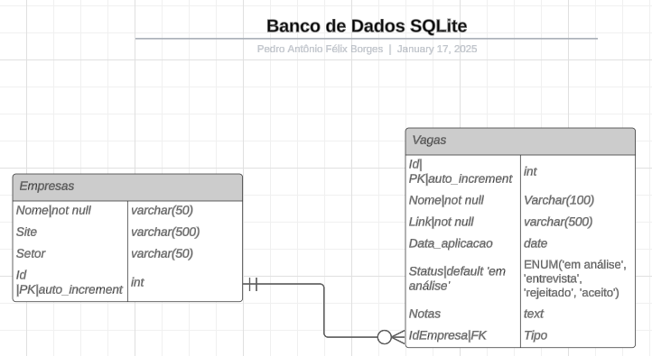

# **TrackJobs - Gerenciador de Aplicações de Emprego**

## **Requisitos do Projeto**

Este documento detalha os requisitos necessários para desenvolver o sistema **TrackJobs**, desde as funcionalidades principais até os objetivos técnicos. O objetivo é criar uma ferramenta funcional e prática para acompanhar candidaturas de emprego e gerar insights úteis.

---

### **Funcionalidades Principais**

1. **Cadastro de Empresas**
   - Permitir registrar informações básicas das empresas.
   - Campos:
     - Nome da empresa.
     - Setor/Área de atuação.
     - Link do site ou da vaga.

2. **Registro de Candidaturas**
   - Associar cada candidatura a uma empresa cadastrada.
   - Campos:
     - Nome da vaga.
     - Data da aplicação.
     - Status da candidatura (em análise, entrevista, rejeitado, aceito).
     - Nome e contato do recrutador.
     - Notas ou comentários.
     - Requisitos da vaga (Python, SQL, Git, etc.).

3. **Relatórios e Estatísticas**
   - Quantidade de candidaturas enviadas por mês.
   - Taxa de resposta das empresas.
   - Distribuição de status das candidaturas (análise, entrevista, etc.).
   - **Análise de requisitos das vagas:**
     - Requisitos mais comuns (Top 5, Top 10).
     - Percentual de vagas que mencionam cada requisito.

4. **Exportação de Dados**
   - Exportar relatórios em formatos CSV e PDF.
   - Personalização dos relatórios, como filtros por status ou data.

5. **Busca e Filtros**
   - Filtro por status, data de aplicação, ou empresa.
   - Busca por palavras-chave nas notas ou requisitos.

---

### **Requisitos Técnicos**

1. **Banco de Dados**

   

2. **Backend**
   - Linguagem: Python.
   - Bibliotecas recomendadas:
     - `sqlite3`: Gerenciamento do banco de dados.
     - `csv`: Exportação para arquivos CSV.
     - `fpdf` ou `reportlab`: Geração de PDFs.

3. **Interface (Opcional)**
   - Menu interativo no terminal.
   - Biblioteca recomendada: `rich`.

4. **Relatórios e Estatísticas**
   - Análise de dados:
     - Contar a frequência de requisitos em todas as candidaturas.
     - Gerar gráficos simples (opcional, usando `matplotlib` ou similar).

---

**TrackJobs** é uma ferramenta prática para otimizar a organização de processos seletivos, oferecendo insights valiosos sobre o mercado e ajudando no planejamento de sua carreira. 🚀
